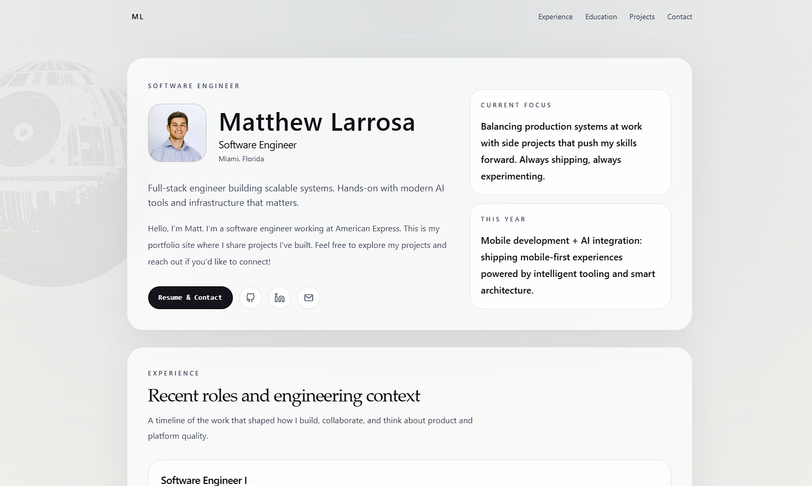

# Portfolio

A fast, minimal personal portfolio built with modern web technologies. Showcasing work, experience, and ongoing projects.

## Overview

This portfolio is designed to be clean, maintainable, and focused. All content is stored in structured TypeScript files, making it easy to update and evolve. The site is fully typed, statically generated, and optimized for performance. Less is more. Tried to keep it simple with this one. 

## Tech Stack

- **Framework**: Next.js 16
- **Language**: TypeScript
- **UI**: React 19
- **Styling**: Tailwind CSS
- **Hosting**: Vercel

## Design Approach

- **Minimal & purposeful** — No unnecessary visual noise, every element serves a function
- **Single-page scan** — Information architecture optimized for quick browsing
- **Accessible** — Built with semantic HTML and proper contrast
- **Dark-friendly** — Contains a subtle background treatment instead of relying on heavy imagery
